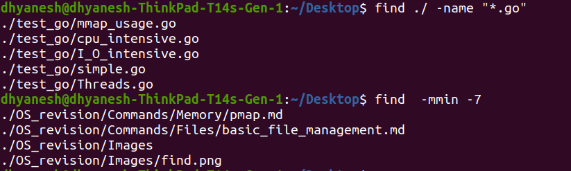

# Basic File management commands

| Command  | Description | Example |
|----------|------------|---------|
| `ls`     | List files and directories. | `ls -la` (Show all files with details) |
| `pwd`    | Print the current working directory. | `pwd` (Displays the current path) |
| `cd`     | Change directory. | `cd /home/user/Documents` |
| `mkdir`  | Create a new directory. | `mkdir new_folder` |
| `rmdir`  | Remove an empty directory. | `rmdir old_folder` |
| `rm`     | Remove files or directories. | `rm -rf folder_name` (Delete folder recursively) |
| `touch`  | Create an empty file or update timestamp. | `touch file.txt` |
| `cp`     | Copy files or directories. | `cp file.txt /backup/` |
| `mv`     | Move or rename files and directories. | `mv old.txt new.txt` (Rename file) |
| `find`   | Search for files and directories. | `find / -name "*.log"` (Find all `.log` files) |

## `find`
The `find` command in Linux is used to search for files and directories in a directory hierarchy based on various criteria such as name, size, type, modification time, and permissions.
Syntax: `find [path] [expression]`

| Expression               | Description                                      |
|--------------------------|--------------------------------------------------|
| `-name "file"`           | Find file by exact name                          |
| `-iname "file"`          | Case-insensitive search                          |
| `-type f`                | Find regular files                               |
| `-type d`                | Find directories                                 |
| `-size +10M`             | Find files larger than 10MB                      |
| `-size -1k`              | Find files smaller than 1KB                      |
| `-mtime -7`              | Files modified in the last 7 days                |
| `-mmin -7`              | Files modified in the last 7 minutes                |
| `-perm 777`              | Files with full permissions                      |
| `-user john`             | Files owned by user `john`                       |
| `-group developers`      | Files owned by group `developers`                |
| `-exec command {} \;`    | Execute command on found files                   |


## `lsof` List Open Files
- It is used to display information about open files and the processes using them. 
- **Since everything in Linux is treated as a file, lsof can monitor open files, network sockets, directories, and devices.**
#### Syntax `lsof [options] [file|directory|process ID]`

| Flag      | Description                                           | Example Usage                     |
|-----------|-------------------------------------------------------|-----------------------------------|
| `-u`      | Show open files for a specific user                   | `lsof -u user1`                   |
| `-p`      | List files opened by a specific process ID            | `lsof -p 1234`                    |
| `-c`      | Show open files for processes matching a command name | `lsof -c apache`                  |
| `-d`      | Show files opened with a specific file descriptor     | `lsof -d 2` (stderr)              |
| `-t`      | Display only process IDs of processes with open files | `lsof -t /var/log/syslog`         |
| `-i`      | List open network connections                         | `lsof -i`                         |
| `-i :port`| Show processes using a specific network port          | `lsof -i :80`                     |
| `-i TCP/UDP` | Show TCP or UDP connections                        | `lsof -i TCP` or `lsof -i UDP`    |
| `-n`      | Prevent DNS lookup for faster output                  | `lsof -n -i`                      |
| `+D`      | Recursively list all open files in a directory        | `lsof +D /var/log/`               |
| `+L`      | List open files with links count less than specified  | `lsof +L1` (deleted files)        |
| `-r`      | Repeat the listing every N seconds                    | `lsof -r 5`                       |
| `-X`      | Prevent reporting of TCP, UDP, and IPv4/IPv6 files    | `lsof -X`                         |

#### Example output
```sh
dhyanesh@dhyanesh-ThinkPad-T14s-Gen-1:~/Desktop$ sudo lsof -p 1467
[sudo] password for dhyanesh: 
Sorry, try again.
[sudo] password for dhyanesh: 
lsof: WARNING: can't stat() fuse.gvfsd-fuse file system /run/user/1000/gvfs
      Output information may be incomplete.
lsof: WARNING: can't stat() fuse file system /run/user/1000/doc
      Output information may be incomplete.
COMMAND    PID       USER   FD      TYPE             DEVICE   SIZE/OFF       NODE NAME
clickhous 1467 clickhouse  cwd       DIR              259,2       4096          2 /
clickhous 1467 clickhouse  rtd       DIR              259,2       4096          2 /
clickhous 1467 clickhouse  txt       REG              259,2  544518752    7995512 /usr/bin/clickhouse
clickhous 1467 clickhouse  mem       REG              259,2 1919097960    8273449 /usr/lib/debug/usr/bin/clickhouse.debug
clickhous 1467 clickhouse  mem       REG              259,2    5699248    7995509 /usr/lib/locale/locale-archive
clickhous 1467 clickhouse  DEL       REG              259,2               7997647 /usr/lib/x86_64-linux-gnu/libnss_files-2.31.so
clickhous 1467 clickhouse  DEL       REG              259,2               7997608 /usr/lib/x86_64-linux-gnu/libdl-2.31.so
clickhous 1467 clickhouse  DEL       REG              259,2               7997612 /usr/lib/x86_64-linux-gnu/libm-2.31.so
clickhous 1467 clickhouse  DEL       REG              259,2               7997604 /usr/lib/x86_64-linux-gnu/libc-2.31.so
clickhous 1467 clickhouse  DEL       REG              259,2               7997666 /usr/lib/x86_64-linux-gnu/libpthread-2.31.so
clickhous 1467 clickhouse  DEL       REG              259,2               7997675 /usr/lib/x86_64-linux-gnu/librt-2.31.so
...
```


- **COMMAND**: Name of the process
- **PID**: Process ID
- **USER**: Owner of the process
- **FD**: File descriptor (e.g., cwd, txt, mem, 1w for stdout)
- **TYPE**: Type of file (e.g., REG, DIR, CHR, FIFO, IPv4)
- **DEVICE**: Device identifier
- **SIZE/OFF**: File size or offset
- **NODE**: Node number (inode)
- **NAME**: File path or socket information