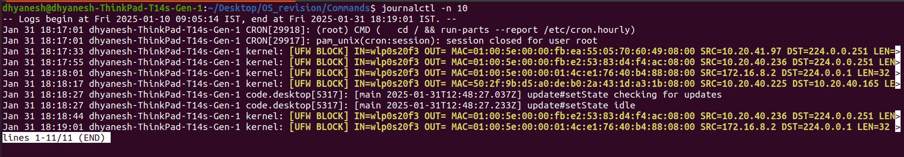

# `journalctl` for *syslogs*.
- `journalctl` is a command-line utility for querying and displaying logs from `systemd-journald`, the logging service of `systemd`.

## Basic Usage
- `journalctl` (without arguments) shows the entire system log.
- `journalctl -n 50` shows the last 50 log entries.
- `journalctl -f` follows the log in real time (similar to `tail -f /var/log/syslog`).



## Output structure:
- Timestamp (Jan 31 10:15:20)
- Hostname (myhost)
- Process generating the log (systemd[1], kernel, sudo[1234])
- Log message (Started User Manager for UID 1000, etc.)

Eg. `Jan 31 10:15:20 myhost systemd[1]: Started User Manager for UID 1000.`


## Filtering Logs
- `journalctl -u <unit>` shows logs for a specific systemd unit (e.g., `journalctl -u sshd` for SSH logs).
- `journalctl --since "2025-01-01 00:00:00"` filters logs from a specific time.
- `journalctl --since yesterday` shows logs from yesterday.
- `journalctl --until "2025-01-30 23:59:59"` filters logs until a specific time.
- `journalctl --since "1 hour ago"` shows logs from the last hour.
- `journalctl -p <priority>` filters logs by priority (`0` for emerg, `1` for alert, `2` for crit, etc.). Example: `journalctl -p 3` shows logs of priority `err` or higher.

## Kernel Logs
- `sudo journalctl -k` 

## Managing Logs
- `journalctl --disk-usage` displays the disk space used by logs.
- `journalctl --vacuum-size=500M` reduces logs to 500MB.
- `journalctl --vacuum-time=7d` keeps logs only for the last 7 days.

## Persistent Logging
- By default, logs are stored in memory (`/run/log/journal`), and lost on reboot.
- To enable persistent logging:
  ```sh
  sudo mkdir -p /var/log/journal
  sudo systemctl restart systemd-journald
  ```
- Check storage location: `journalctl --verify`

## Important Log Files and Directories in Ubuntu
### System Logs
- `/var/log/syslog` – General system logs.
- `/var/log/kern.log` – Kernel logs.
- `/var/log/auth.log` – Authentication logs (logins, sudo usage).
- `/var/log/dmesg` – Boot-related kernel logs.
- `/var/log/boot.log` – Boot process logs.

### Application & Service Logs
- `/var/log/apache2/` – Apache HTTP server logs.
- `/var/log/nginx/` – Nginx web server logs.

### Security & Authentication Logs
- `/var/log/faillog` – Failed login attempts.
- `/var/log/wtmp` – Login records (`last` command to read).
- `/var/log/btmp` – Failed login attempts (`lastb` to read).

## Exporting Logs
- `journalctl > logs.txt` saves logs to a text file.
- `journalctl -o json` outputs logs in JSON format.
- `journalctl -o short-monotonic` shows logs with monotonic timestamps.

## Additional Options
- `journalctl -b` shows logs from the current boot.
- `journalctl -b -1` shows logs from the previous boot.
- `journalctl --no-pager` disables paging.


