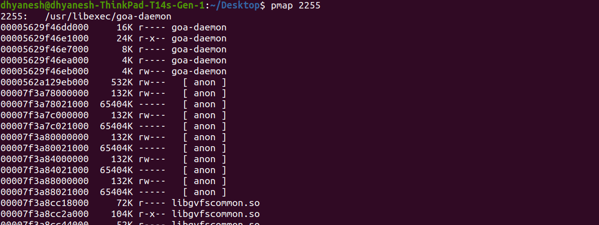

# `pmap` - Process Memory Map

The `pmap` command provides detailed information about how a process's address space is structured, including shared libraries, stack, heap, and mapped files. It is particularly useful for debugging memory usage in applications.

## Syntax
```sh
pmap [options] <pid>
```



## Options

| Option | Description |
|--------|-------------|
| `-x`   | Extended format, showing detailed memory usage (size, RSS, dirty pages). |
| `-X`   | Like `-x`, but with more columns for detailed memory analysis. |
| `-d`   | Shows device mapping details. |
| `-q`   | Quiet mode; suppresses header and summary information. |
| `-A`   | Displays address space details in hexadecimal format. |
| `-n`   | Does not display header/footer, useful for scripting. |
| `-p`   | Shows memory permissions (read, write, execute) for each mapping. |
| `-c`   | Shows memory consumption in kilobytes instead of pages. |

## Columns in `pmap -x`

| Column   | Description |
|----------|-------------|
| Address  | Starting memory address of the mapped region. |
| Kbytes   | Total allocated memory for this segment (in kilobytes). |
| RSS (Resident Set Size) | The portion of memory held in RAM (not swapped out). |
| Dirty    | Memory pages modified by the process (unshared). |
| Mode     | Memory permissions: `r` (read), `w` (write), `x` (execute), `s` (shared), `p` (private). |
| Mapping  | The file or memory object associated with this region (e.g., binaries, shared libraries, `[ anon ]` for anonymous memory). |

## Common Special Outputs in Mapping Column

| Mapping       | Description |
|--------------|-------------|
| `[ anon ]`   | Anonymous memory region (allocated via `mmap` without a file backing it). Used for heap, dynamically allocated memory, and memory-mapped files. |
| `[ stack ]`  | Stack segment for the process, used for function calls, local variables, and execution context. |
| `[ heap ]`   | Heap memory dynamically allocated using `malloc`, `calloc`, `new`, etc. |
| `[ vdso ]`   | Virtual dynamic shared object, a small shared library mapped by the kernel for fast system calls. |
| `[ vvar ]`   | Virtual variables page, used to expose kernel version timestamps to user space. |
| `[ vsyscall ]` | Deprecated system call page for optimized syscall execution in older Linux versions. |
| `[ tls ]`    | Thread-local storage, used to store thread-specific data. |
| `[ stack:tid ]` | Stack for a specific thread in multi-threaded applications (`tid` is the thread ID). |
| `[ heap:pid ]` | Heap segment for a specific process (`pid` is the process ID). |
| `/path/to/file` | Mapped file or shared library (e.g., `/usr/lib/libc.so.6`). These are memory-mapped executables or shared libraries. |
| `[ memfd:... ]` | Anonymous shared memory created using `memfd_create`, often used for IPC (inter-process communication). |
| `[ shmem ]`  | Shared memory, used by multiple processes for communication (e.g., `shmget`). |
| `[ stackguard ]` | Guard page to prevent stack overflows by triggering a segmentation fault on access. (They have `-----` in their permissions.) |

