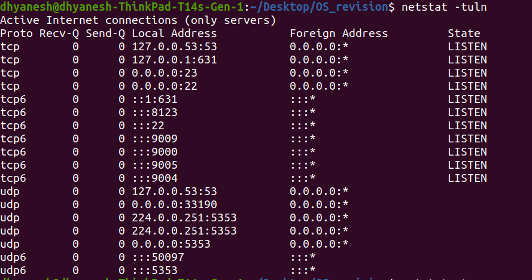

## Commands for port rechability:
1. `netstat` : stands for Network Statistics.<br/>
Options explained:
    ```
    -t : Show TCP connections
    -u : Show UDP connections
    -l : Show only listening ports
    -n : Show numerical addresses
    -p : Show process/program name (requires root)
    -a : Show all sockets
    -r : Show routing table
    ```
    Example: ``netstat -tuln``
    
    <br>Show statistics for all protocols: `netstat -s`
2. `nc`: stands for NetCat.
- Testing ports:
    ```sh
    # Check if port 80 is open
    nc -zv example.com 80

    # Check multiple ports
    nc -zv example.com 20-25

    # UDP port scanning
    nc -zuv example.com 53
    ``` 
- File Transfer:
    ```sh
    # On receiving machine
    nc -l 1234 > received_file.txt

    # On sending machine
    nc 192.168.1.100 1234 < file_to_send.txt
    ```
3. `ss`: socket 