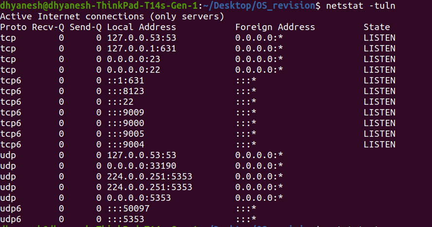

# Commands for port rechability:
## `netstat` : stands for Network Statistics.<br/>
Options explained:
```sh
-t : Show TCP connections
-u : Show UDP connections
-l : Show only listening ports
-n : Show numerical addresses
-p : Show process/program name (requires root)
-a : Show all sockets
-r : Show routing table
```
Example: ``netstat -tuln``<br>

<br>Show statistics for all protocols: `netstat -s`

## `nc`: stands for NetCat.<br>
Testing ports:
```sh
# Check if port 80 is open
nc -zv example.com 80

# Check multiple ports
nc -zv example.com 20-25

# UDP port scanning
nc -zuv example.com 53
``` 
File Transfer:
```sh
# On receiving machine
nc -l 1234 > received_file.txt

# On sending machine
nc 192.168.1.100 1234 < file_to_send.txt
```
1. `telnet`: It can be used to verify open **TCP** ports on a remote system.
- `telnet <IP/hostname> <port>` to verify the rechability of the port.

    
