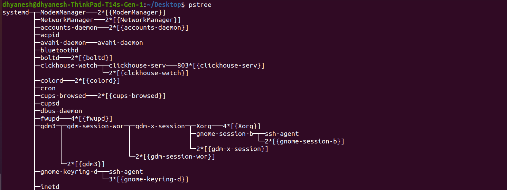
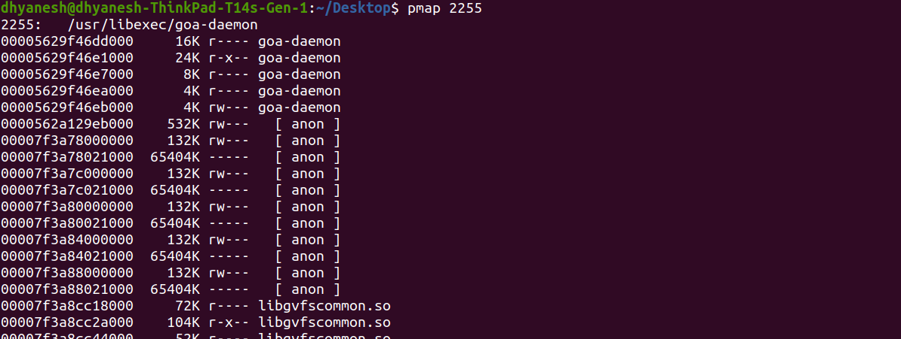

### `ps`: Process Status command is used to display info about active processes.
-  Unlike `top`, which provides real-time monitoring, `ps` shows a snapshot of processes at the moment it is executed.
1. Only `ps` shows processes running in the *current shell session*.
    ```sh
    dhyanesh@dhyanesh-ThinkPad-T14s-Gen-1:~/Desktop$ ps
    PID TTY          TIME CMD
    5438 pts/1    00:00:00 bash
    23416 pts/1    00:00:00 ps
    ```
1. `ps -e` or `ps -A` *Lists all the process running in the system*.
    - `-F` lists processes with detailed format.
    ```sh
    dhyanesh@dhyanesh-ThinkPad-T14s-Gen-1:~/Desktop$ ps -F
    UID          PID    PPID  C    SZ   RSS PSR STIME TTY          TIME CMD
    dhyanesh    5438    2917  0  2984  6340   0 Jan28 pts/1    00:00:00 bash
    dhyanesh   25367    5438  0  2874  3296   5 16:47 pts/1    00:00:00 ps -F
    ```
    - *UID*: User identifier - shows which user owns the process (in this case "dhyanesh")
    - *PID*: Process ID - unique identifier assigned to each process (5438 and 25367 in your output)
    - *PPID*: Parent Process ID - ID of the process that spawned this process (2917 and 5438 in your output)
    - *C*: CPU utilization - percentage of CPU usage (both showing 0 in your case)
    - *SZ*: Size in physical pages - total size of the process in memory pages (2984 and 2874 pages)
    - *RSS*: Resident Set Size - amount of physical memory (RAM) the process is using in kilobytes (6340KB and 3296KB)
    - *PSR*: Processor - shows which CPU core the process is running on (0 and 5 in your case)
    - *STIME*: Start time - when the process began (Jan28 and 16:47)
    - *TTY*: Terminal type - the terminal the process is running in (pts/1 for both)
    - *TIME*: CPU time - amount of CPU time the process has used (00:00:00 for both)
    - *CMD*: Command - the command that started the process (bash and ps -F)
1. `ps -p <PID>` displays info for specific process.
    - To list any specific information `-o` flag is used.
    ```sh
    dhyanesh@dhyanesh-ThinkPad-T14s-Gen-1:~/Desktop$ ps -p 1472 -o pid,ppid,cmd,%mem,%cpu
    PID    PPID CMD                         %MEM %CPU
    1472    1459 /usr/bin/clickhouse-server   4.9  5.5
    ```
1. `ps -u username`: Lists processes for a specific username.
1. `ps -L`: Shows threads ('light-weight processes')
    - It includes LWP: Light weight Process Id.
    - using `-m` will show threads after parent processes.

1. `ps aux`:
    The aux flags combined mean:
    - a: Show processes from all users
    - u: Display in user-oriented format
    - x: Include processes without controlling terminal
    ```sh
    dhyanesh@dhyanesh-ThinkPad-T14s-Gen-1:~/Desktop$ ps aux
    USER         PID %CPU %MEM    VSZ   RSS TTY      STAT START   TIME COMMAND
    root           1  0.0  0.0 169768 13292 ?        Ss   Jan28   0:08 /sbin/init splash
    root           2  0.0  0.0      0     0 ?        S    Jan28   0:00 [kthreadd]
    root           3  0.0  0.0      0     0 ?        I<   Jan28   0:00 [rcu_gp]
    root           4  0.0  0.0      0     0 ?        I<   Jan28   0:00 [rcu_par_gp]
    root           5  0.0  0.0      0     0 ?        I<   Jan28   0:00 [slub_flushwq]
    root           6  0.0  0.0      0     0 ?        I<   Jan28   0:00 [netns]
    root           8  0.0  0.0      0     0 ?        I<   Jan28   0:00 [kworker/0:0H-events_highpri]
    ```
    - STAT: Process state codes:
        - R: Running or runnable
        - S: Sleeping (interruptible)
        - D: Uninterruptible sleep
        - Z: Zombie
        - T: Stopped/traced
        - +: In foreground process group
        - s: Session leader
        - l: Multi-threaded
        - <: High priority
        - N: Low priority
    - COMMAND: Command with all its arguments - full command that started the process

1. `ps -l` shows process in long format. Extra field here are:
    - *PRI*: Priority - process scheduling priority
    - *NI*: Nice value - process nice level (-20 to +19)
    - *ADDR*: Memory address - if not 0, the segment number of the process
    - *SZ*: Size - core image size (in pages) of the process
    - *WCHAN*: Name of CPU wait channel - where process is sleeping
1. `ps [options] --sort [+|-]key[,` will sort results based on the key.
    - `ps aux --sort=-pcpu` will sort by CPU usage. (-) descending / (+)ascending
    - Common sort keys:
        - *pcpu*: CPU usage
        - *pmem*: Memory usage
        - *pid*: Process ID
        - *comm*: Command name
        - *start_time*: Process start time
        - *rss*: Resident Set Size
        - *vsz*: Virtual memory size
        - *tty*: Terminal name
        - *user*: Username


---


# `ps` (Process Status) Command

The `ps` command is used to display information about active processes. Unlike `top`, which provides real-time monitoring, `ps` shows a snapshot of processes at the moment it is executed.

## Basic Usage

### Current Shell Session
Running `ps` alone shows processes running in the current shell session:
```sh
dhyanesh@dhyanesh-ThinkPad-T14s-Gen-1:~/Desktop$ ps
PID TTY          TIME CMD
5438 pts/1    00:00:00 bash
23416 pts/1    00:00:00 ps
```

### All Processes
`ps -e` or `ps -A` lists all processes running in the system.

### Detailed Format
Using `-F` lists processes with detailed format:
```sh
dhyanesh@dhyanesh-ThinkPad-T14s-Gen-1:~/Desktop$ ps -F
UID          PID    PPID  C    SZ   RSS PSR STIME TTY          TIME CMD
dhyanesh    5438    2917  0  2984  6340   0 Jan28 pts/1    00:00:00 bash
dhyanesh   25367    5438  0  2874  3296   5 16:47 pts/1    00:00:00 ps -F
```

#### Field Descriptions
- **UID**: User identifier - shows which user owns the process
- **PID**: Process ID - unique identifier assigned to each process
- **PPID**: Parent Process ID - ID of the process that spawned this process
- **C**: CPU utilization - percentage of CPU usage
- **SZ**: Size in physical pages - total size of the process in memory pages
- **RSS**: Resident Set Size - amount of physical memory (RAM) the process is using in kilobytes
- **PSR**: Processor - shows which CPU core the process is running on
- **STIME**: Start time - when the process began
- **TTY**: Terminal type - the terminal the process is running in
- **TIME**: CPU time - amount of CPU time the process has used
- **CMD**: Command - the command that started the process

## Common Options

### Process Selection
- `ps -p <PID>`: Display info for specific process
- `ps -u username`: List processes for specific username
- `ps -L`: Show threads ('light-weight processes')
  - Includes LWP (Light Weight Process Id)
  - `-m`: Show threads after parent processes

### Full System Process View
`ps aux` command combines:
- a: Show processes from all users
- u: Display in user-oriented format
- x: Include processes without controlling terminal

Example output:
```sh
dhyanesh@dhyanesh-ThinkPad-T14s-Gen-1:~/Desktop$ ps aux
USER         PID %CPU %MEM    VSZ   RSS TTY      STAT START   TIME COMMAND
root           1  0.0  0.0 169768 13292 ?        Ss   Jan28   0:08 /sbin/init splash
root           2  0.0  0.0      0     0 ?        S    Jan28   0:00 [kthreadd]
root           3  0.0  0.0      0     0 ?        I<   Jan28   0:00 [rcu_gp]
root           4  0.0  0.0      0     0 ?        I<   Jan28   0:00 [rcu_par_gp]
root           5  0.0  0.0      0     0 ?        I<   Jan28   0:00 [slub_flushwq]
root           6  0.0  0.0      0     0 ?        I<   Jan28   0:00 [netns]
root           8  0.0  0.0      0     0 ?        I<   Jan28   0:00 [kworker/0:0H-events_highpri]
```

### Process States (STAT column)
- **R**: Running or runnable
- **S**: Sleeping (interruptible)
- **D**: Uninterruptible sleep
- **Z**: Zombie
- **T**: Stopped/traced
- **+**: In foreground process group
- **s**: Session leader
- **l**: Multi-threaded
- **<**: High priority
- **N**: Low priority

### Long Format
`ps -l` shows process in long format with additional fields:
- **PRI**: Process scheduling priority
- **NI**: Nice value (-20 to +19)
- **ADDR**: Memory address (segment number if not 0)
- **SZ**: Core image size (in pages)
- **WCHAN**: Name of CPU wait channel

### Custom Output
Using `-o` flag for specific information:
```sh
dhyanesh@dhyanesh-ThinkPad-T14s-Gen-1:~/Desktop$ ps -p 1472 -o pid,ppid,cmd,%mem,%cpu
PID    PPID CMD                         %MEM %CPU
1472    1459 /usr/bin/clickhouse-server   4.9  5.5
```

## Sorting Results
Use `ps [options] --sort [+|-]key[,]` to sort results:
- `ps aux --sort=-pcpu`: Sort by CPU usage (descending)
- `ps aux --sort=+pcpu`: Sort by CPU usage (ascending)

### Common Sort Keys
- **pcpu**: CPU usage
- **pmem**: Memory usage
- **pid**: Process ID
- **comm**: Command name
- **start_time**: Process start time
- **rss**: Resident Set Size
- **vsz**: Virtual memory size
- **tty**: Terminal name
- **user**: Username

## Using selectors with ps
- Use `ps aux | grep [process_name/keyword]` to find specific processes or filter using keyword.
- Combine with `watch` command for periodic updates: `watch ps aux`
- Use `ps -eo pid,ppid,cmd,%mem,%cpu --sort=-%mem | head` to see top memory-consuming processes
- `awk` can also be used to search based on pattern.


## Other Commands built over `ps`

#### `pstree`-Displays processes in a hierarchical tree format.


- `-p` flag can be used to display processIds.


#### `pgrep <process_name>` Finds and lists PIDs of processes matching a given name.
Useful Options:
- `pgrep -u <user>` → Find processes owned by a specific user.
- `pgrep -l <name>` → Show process name along with PID.
- `pgrep -P <PPID>` → Find child processes of a specific parent PID.
- `pgrep -n <name>` → Get the most recently started process matching the name.
- `pgrep -o <name>` → Get the oldest running process matching the name.

#### `pkill <process_name>` Kills all the process with matching name.

#### `pmap <PID>` Shows memory map of a process.



