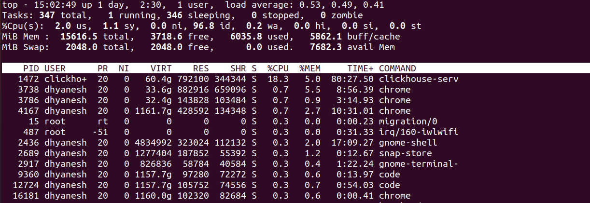
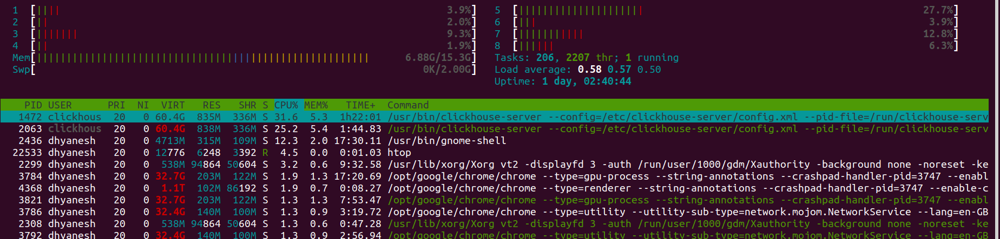

# `top` and `htop` Commands Documentation

Both `top` and `htop` are real-time system monitoring tools that display system processes, resource usage, and performance metrics.

## top Command


### Interactions in top
```sh
Help for Interactive Commands - procps-ng 3.3.16
Window 1:Def: Cumulative mode Off.  System: Delay 3.0 secs; Secure mode Off.

  Z,B,E,e   Global: 'Z' colors; 'B' bold; 'E'/'e' summary/task memory scale
  l,t,m     Toggle Summary: 'l' load avg; 't' task/cpu stats; 'm' memory info
  0,1,2,3,I Toggle: '0' zeros; '1/2/3' cpus or numa node views; 'I' Irix mode
  f,F,X     Fields: 'f'/'F' add/remove/order/sort; 'X' increase fixed-width

  L,&,<,> . Locate: 'L'/'&' find/again; Move sort column: '<'/'>' left/right
  R,H,J,C . Toggle: 'R' Sort; 'H' Threads; 'J' Num justify; 'C' Coordinates
  c,i,S,j . Toggle: 'c' Cmd name/line; 'i' Idle; 'S' Time; 'j' Str justify
  x,y     . Toggle highlights: 'x' sort field; 'y' running tasks
  z,b     . Toggle: 'z' color/mono; 'b' bold/reverse (only if 'x' or 'y')
  u,U,o,O . Filter by: 'u'/'U' effective/any user; 'o'/'O' other criteria
  n,#,^O  . Set: 'n'/'#' max tasks displayed; Show: Ctrl+'O' other filter(s)
  V,v     . Toggle: 'V' forest view; 'v' hide/show forest view children

  k,r       Manipulate tasks: 'k' kill; 'r' renice
  d or s    Set update interval
  W,Y       Write configuration file 'W'; Inspect other output 'Y'
  q         Quit
          ( commands shown with '.' require a visible task display window ) 
Press 'h' or '?' for help with Windows,
Type 'q' or <Esc> to continue 

```

### Load Average:
- Load Average is a measure of the system’s workload over time.
- It’s displayed as three numbers, representing averages over 1 minute, 5 minutes, and 15 minutes.
  1. Single-Core System: A load average of 1.0 means the CPU is fully utilized. Values above 1.0 indicate processes are waiting for CPU time.

  2. Multi-Core System: Divide the load average by the number of CPU cores to determine utilization. For example:
    - A load average of 4.0 on a 4-core system means the CPU is fully utilized.
    - A load average of 8.0 on a 4-core system means the system is overloaded (processes are waiting).

### Process States
- Running (R)
- Sleeping (S)
- UnInterruptable Sleep (D)
- Suspended processes (T)
- Zombie (Z)

### Zombie Processes
- A zombie process (or defunct process) is a terminated process that remains in the process table because its parent has not yet read its exit status. Until the parent acknowledges the child’s termination, the kernel retains minimal information about the process (e.g., process ID, exit code), creating a "zombie."
- Causes includes:
  - The parent process does not call `wait()` or `waitpid()` to read the child’s exit status. So the main cause is the parent not properly handling the `SIGCHLD` signal or not calling wait()/waitpid().
  - The parent is stuck in an infinite loop, handling other tasks, or crashes before reading the child’s status.

### Orphaned Processes
- If the parent dies before the child, the child becomes an orphan and is adopted by the `init` process (PID 1).
- The `init` process automatically reaps orphans, so zombies are temporary here.


### CPU Time Categories
<!-- - **User mode (us)** - User Processes
- **System mode (sy)** - System Processes (running in priviledged mode/ in kernel space)
- **Nice mode (ni)** - CPU time spent running user processes with adjusted priority *(nice value)*.
  - Low-priority tasks consuming CPU (e.g., background batch jobs).
- **Idle (id)** - CPU Idle time.
- **Waiting for I/O (wa)** - 
- Hardware interrupts (hi)
- Software interrupts (si)
- Steal time (st) -->
| **Metric** | **Full Name**               | **Description**                                                                 | **High Value Indicates**                                                                 |
|------------|-----------------------------|---------------------------------------------------------------------------------|-----------------------------------------------------------------------------------------|
| **us**     | User Space                  | CPU time spent executing **user-level processes** (e.g., apps, scripts).        | CPU-intensive applications (e.g., video encoding, simulations).                         |
| **sy**     | Kernel Space (System)       | CPU time spent executing **kernel-level processes** (e.g., system calls, interrupts). | Kernel bottlenecks (e.g., excessive context switching, disk/network drivers).           |
| **ni**     | Nice (Low-Priority User)    | CPU time spent running **user processes with adjusted priority** (`nice` value). | Low-priority tasks consuming CPU (e.g., background batch jobs).                         |
| **id**     | Idle                        | CPU time **not being used**.                                                    | Underutilized system. High `id` is normal unless resources are expected to be busy.     |
| **wa**     | I/O Wait                    | CPU time **waiting for I/O operations** (disk, network) to complete.            | Disk/network bottlenecks (e.g., slow database queries, heavy file I/O).                 |
| **hi**     | Hardware Interrupts         | CPU time handling **hardware interrupts** (e.g., keyboard, NIC, disk controller).| Hardware issues or high interrupt-driven devices (e.g., faulty NIC, heavy disk usage).  |
| **si**     | Software Interrupts         | CPU time handling **software interrupts** (e.g., task scheduling, timers).      | Kernel scheduling overhead (e.g., many threads/tasks, network packet processing).       |
| **st**     | Steal Time                  | CPU time "stolen" from a **virtual machine (VM)** by the hypervisor.            | Overcommitted resources in virtualized/cloud environments (e.g., noisy neighbors).      |


### Process Information Fields
- **PID**: Process ID
- **USER**: User owning the process
- **PR**: Process priority (PR = 20 + NI)
- **NI**: Nice value (priority modifier)
- **VIRT**: Total amount of Virtual memory used by the process
  - Memory used by the process itself (e.g., code, stack, heap).
  - Memory-mapped files (e.g., shared libraries).
  - Swap space (if the process is using swap).
  - Reserved but unused memory.
  - **pages for the particular process is in `/proc/<pid>/maps` directory**
- **RES**: Resident memory (physical memory) used by the process
- **SHR**: Shared memory used by the process
- **S**: Process state
- **%CPU**: CPU usage of the process
- **%MEM**: Memory usage of the process
- **TIME+**: Total CPU time consumed by the process
- **COMMAND**: Command or name of the process

## htop Command


htop is an improved version of top with additional features:
- Interactive process viewer
- Visual color-coded indicators
- Horizontal and vertical process views
- Better handling of process sorting
- Built-in kill command
