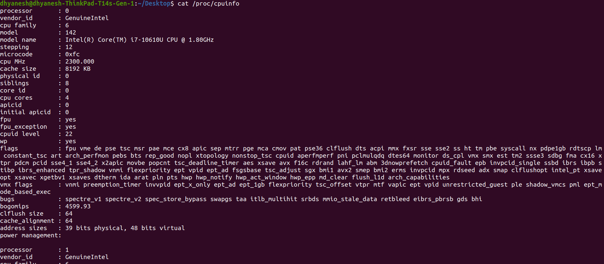

# `/proc/` folder in linux.

- The `/proc/` directory is a virtual filesystem (procfs) in Linux that provides information about system processes and hardware in real-time.
- It acts as an interface between userspace and the kernel, allowing users to retrieve system information, including processes, CPU, memory, and more.

- It is a pseudo-filesystem (not stored on disk, but created dynamically in RAM).

- Contains subdirectories named after process IDs (PIDs) (e.g., /proc/1234/ for process 1234) and Includes system-wide information files like /proc/cpuinfo, /proc/meminfo, etc.

Eg.

### Other key fields:
**MemTotal**- Total system RAM available
**MemFree**- Unused memory
**Buffers**- Memory used for disk buffering
**Cached**- Cached memory (used but available for reuse)
**SwapTotal**- Total swap space
**SwapFree**- Free swap space

## Important Folders
