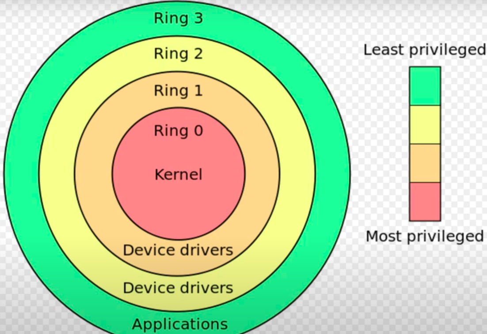

# Kernel of Linux
Linux is a monolithic kernel but with modular capabilities. While it follows the monolithic kernel architecture, it also supports **loadable kernel modules (LKMs)**, making it a modular kernel in practice.
- A loadable kernel module (LKM) is an executable library that extends the capabilities of a running kernel, or so-called base kernel, of an operating system.
- The modular approach allows users to extend the kernel without modifying or recompiling the core.


## Overview of User space and Kernel space
- In an operating system, there are two primary spaces where code can execute: user space and kernel space. User space is where user applications execute, while kernel space is where the operating system itself and other privileged components execute.
- In kernel space, code has direct access to system resources like memory and hardware, enabling privileged operations not available in user space.
- System calls are used by the userspace processes to access the priviledged resources.


### Memory Space Separation
Linux uses virtual memory management and processor protection rings to create a strict separation:


**Kernel Space (Ring 0)**
- Located in higher memory addresses (typically above 0xC0000000)
- Contains:
  - Core kernel code
  - Device drivers
  - Kernel modules
  - System call handlers
  - Memory management
  - Process scheduling

**User Space (Ring 3)**
- Located in lower memory addresses
- Contains:
  - User applications
  - Libraries
  - Shell processes
  - User utilities

<!-- ## System Calls: The Bridge Between Spaces

### How System Calls Work
```c
// User space program wanting to write to a file
write(fd, buffer, size);

// This triggers a system call using CPU instructions
// On x86: INT 0x80 or SYSCALL
// The CPU switches to ring 0, and the kernel handles the request
``` -->

## Privilege Management

### The sudo Mechanism

1. **What is sudo?**
   - sudo (Superuser Do) is a program that allows users to run programs with the security privileges of another user (by default, the superuser)
   - It's not part of the kernel but works with kernel security mechanisms

2. **How sudo Works:**
```plaintext
User invokes sudo -> sudo checks /etc/sudoers -> Authenticates user -> 
Creates new process with elevated privileges -> Kernel enforces privileges
```

3. **Key Components:**
   - `/etc/sudoers`: Configuration file defining who can use sudo
   - `setuid` bit: Special permission that allows programs to run as owner
   - Process credentials: Real UID, Effective UID, Saved UID

### Example sudoers Configuration
```bash
# /etc/sudoers
# User privilege specification
root    ALL=(ALL:ALL) ALL

# Allow members of group sudo to execute any command
%sudo   ALL=(ALL:ALL) ALL

# Allow user john to run networking commands
john    ALL=(root) /sbin/ifconfig, /sbin/route
```

### Process State Transitions
```plaintext
User Process (UID 1000)
    │
    ▼
sudo command
    │
    ▼
Authentication
    │
    ▼
New Process (EUID 0)
    │
    ▼
Execute Command with Root Privileges
```