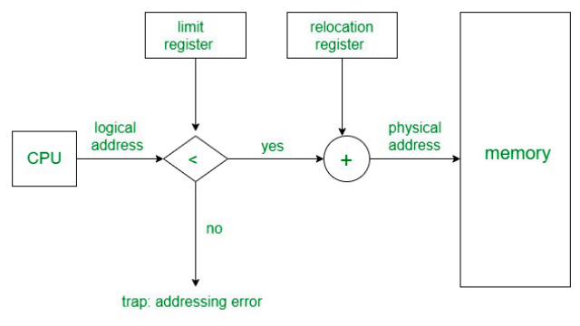

# Memory Management in Multiprogramming Environment

## 1. Logical vs. Physical Addressing

### 1.1 Address Spaces
A process in a multiprogramming system deals with two types of addresses:

- **Logical Address (Virtual Address):** The address generated by the CPU during program execution.
  - The user can access the logical address of the process.
  - The user has indirect access to the physical address through the logical address.
  - The set of all addresses that can be generated by the program is referred to as **Logical Address Space**.
  - **Range:** `0` to `max` (defined by the Limit Register).

- **Physical Address:** The actual location in memory where data is stored.
  - The user can never access the physical address of the program.
  - A set of physical addresses mapped to a logical address space is called the **Physical Address Space**.

## 2. Memory Management Unit (MMU)
**Memory Management Unit (MMU)** is a hardware component that translates logical addresses into physical addresses in real-time.

## 3. Base and Limit Registers
To support multiple processes and ensure memory protection, the OS uses:

- **Base Register:** Stores the starting physical address of the process.
- **Limit Register:** Stores the size of the process memory.

### Example:
Assume the following values:

- **Base Register** = `0x4000`
- **Limit Register** = `0x1000` (Process size is 4KB)

| Logical Address | Translation | Status |
|----------------|-------------|---------|
| `0x0500`      | `0x4000 + 0x0500 = 0x4500` | Allowed (within limit) |
| `0x1200`      | `Exceeds 0x5000` |  Not Allowed |

The MMU ensures that logical addresses exceeding the limit register are not translated, preventing unauthorized memory access.

