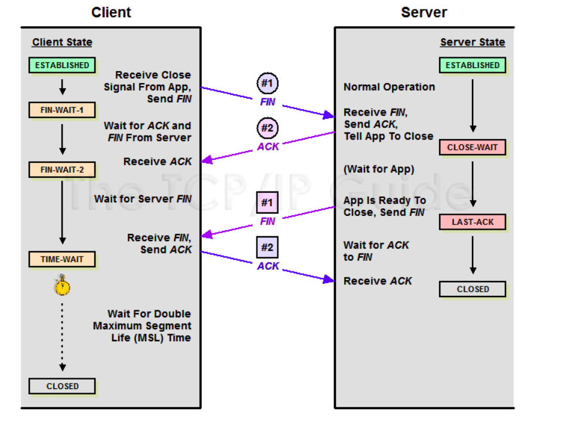

# States of TCP connection

## 1. CLOSED
- There is no connection.

## 2. LISTEN
- The local end-point is waiting for a connection request from a remote end-point.  
- A passive open was performed.

## 3. ESTABLISHED
- The third step of the three-way handshake was completed.  
- The connection is open.

## 4. FIN-WAIT-1
- The first step of an active close (four-way handshake) was performed.  
- The local end-point has sent a connection termination request to the remote end-point.

## 5. CLOSE-WAIT
- The local end-point has received a connection termination request and acknowledged it.  
- A passive close has been performed.  
- The local end-point needs to perform an active close to leave this state.

## 6. FIN-WAIT-2
- The remote end-point has sent an acknowledgment for the previously sent connection termination request.  
- The local end-point waits for an active connection termination request from the remote end-point.

## 7. LAST-ACK
- The local end-point has performed a passive close.  
- It has initiated an active close by sending a connection termination request to the remote end-point.

## 8. CLOSING
- The local end-point is waiting for an acknowledgment for a connection termination request before going to the TIME-WAIT state.

## 9. TIME-WAIT
- The local end-point waits for twice the maximum segment lifetime (MSL) to pass before transitioning to the CLOSED state.  
- Ensures that the remote end-point received the acknowledgment.

